# Pipeline CI/CD do Contact Manager

## Visao geral

O projeto usa GitHub Actions para validar os dois repositorios, GitHub Container
Registry (GHCR) para armazenar as imagens Docker e uma instancia Amazon EC2 para
executar a aplicacao. Frontend e backend possuem pipelines equivalentes e o
deploy somente e executado a partir da branch `master`.

```mermaid
flowchart LR
    G["Push ou Pull Request"] --> Q["Lint e analise estatica"]
    Q --> A["npm audit"]
    A --> T["Testes e cobertura"]
    T --> B["Build de producao"]
    B --> S["SonarCloud"]
    S --> D["Docker build"]
    D --> V["Trivy scan"]
    V --> P["Publicar imagem no GHCR"]
    P -->|"somente master"| E["Atualizar EC2"]
    E --> H["Health check publico"]
```



No backend nao existe uma etapa de compilacao, pois a aplicacao usa JavaScript
executado diretamente pelo Node.js. A geracao do Prisma Client e a construcao da
imagem Docker validam o artefato executavel.

## Gatilhos

| Evento | Branch | Validacoes | Publica imagem | Deploy |
|---|---|---:|---:|---:|
| Pull Request | `dev` ou `master` | sim | nao | nao |
| Push | `dev` | sim | tag `dev` + SHA | nao |
| Push | `master` | sim | tag `master` + SHA | sim |
| Execucao manual | branch escolhida | sim | tag da branch + SHA | somente se `master` |

Estrategia usada pela equipe:

```text
feat/* ou fix/* -> Pull Request -> dev -> Pull Request -> master -> producao
```

## Etapas da pipeline

1. **Checkout:** baixa o commit exato e todo o historico necessario ao
   SonarCloud.
2. **Node.js:** configura a versao 22.14.0 e o cache do npm.
3. **Dependencias:** `npm ci` reproduz exatamente o `package-lock.json`.
4. **Lint/analise estatica:** ESLint verifica TypeScript, JavaScript, templates
   Angular e regras de acessibilidade.
5. **Dependencias vulneraveis:** `npm audit` gera um JSON anexado a execucao. O
   backend bloqueia vulnerabilidades de producao altas ou criticas. O frontend
   bloqueia criticas; avisos altos existentes no Angular 19 ficam registrados e
   exigem uma atividade separada de upgrade do framework.
6. **Testes e cobertura:** o Angular usa Karma/Jasmine/Chrome Headless e o
   backend usa Node Test Runner com c8. A pipeline falha se a cobertura cair
   abaixo dos limites definidos.
7. **Build:** o frontend e compilado com configuracao de producao. Os arquivos
   de build e os relatorios de cobertura/auditoria sao anexados por 30 dias.
8. **SonarCloud:** quando habilitado, analisa bugs, vulnerabilidades, code
   smells, duplicacao e cobertura. O Quality Gate e aguardado pela pipeline.
9. **Container:** constroi a imagem Linux AMD64 que sera implantada.
10. **Trivy:** gera relatorio completo e bloqueia vulnerabilidades altas ou
    criticas com correcao disponivel.
11. **Publicacao:** somente pushes e execucoes manuais publicam imagens no GHCR.
12. **Deploy:** somente `master` conecta na EC2, executa o atualizador de
    containers e espera o health check interno.
13. **Verificacao externa:** o runner consulta `PRODUCTION_URL/api/health`. Sem
    `{"status":"ok"}`, o deploy e marcado como falha.

## Limites iniciais de cobertura

| Projeto | Statements | Branches | Functions | Lines |
|---|---:|---:|---:|---:|
| Frontend | 30% | 10% | 20% | 30% |
| Backend | 80% | 70% | 80% | 80% |

Medicao inicial local na `master`: frontend com 23 testes e aproximadamente 34%
de statements; backend com 17 testes e aproximadamente 84% de statements. Os
limites devem aumentar gradualmente nas proximas Sprints.

## Configuracao do GitHub

Crie um Environment chamado `production` nos **dois** repositorios. Recomenda-se
proteger esse ambiente e permitir deploy apenas pela branch `master`.

Cadastre as seguintes **Environment variables**:

| Nome | Exemplo | Finalidade |
|---|---|---|
| `EC2_HOST` | `203.0.113.10` | IP ou hostname publico da EC2 |
| `EC2_USER` | `ubuntu` | usuario SSH |
| `PRODUCTION_URL` | `https://app.exemplo.com` | URL usada no health check externo |
| `EC2_DEPLOY_COMMAND` | opcional | sobrescreve o comando padrao caso o repositorio esteja em outro caminho |

Cadastre os seguintes **Environment secrets**:

| Nome | Conteudo |
|---|---|
| `EC2_SSH_PRIVATE_KEY` | chave privada exclusiva para o deploy |
| `EC2_KNOWN_HOSTS` | linha verificada da chave publica SSH da EC2 |

O comando padrao executado remotamente e:

```bash
/usr/bin/bash /home/ubuntu/contact-manager/contact-manager-back/deploy/update-containers.sh
```

Para obter `known_hosts`, conecte-se primeiro por um canal confiavel, confira o
fingerprint da EC2 e depois execute localmente:

```bash
ssh-keyscan -H IP_OU_HOST_DA_EC2
```

Nao use `StrictHostKeyChecking=no`. A porta 22 do Security Group precisa aceitar
os runners usados pela pipeline. Como os IPs dos runners hospedados pelo GitHub
mudam, uma melhoria futura e substituir SSH por AWS Systems Manager com OIDC,
eliminando a entrada SSH publica.

Depois que o deploy direto estiver comprovado, o timer antigo pode ser
desabilitado para evitar atualizacoes fora do historico do GitHub Actions:

```bash
sudo systemctl disable --now contact-manager-update.timer
```

## Configuracao do SonarCloud

1. Crie/importa a organizacao `conradocmatheus` no SonarCloud.
2. Importe os repositorios com as chaves:
   - `conradocmatheus_contact-manager-front`;
   - `conradocmatheus_contact-manager-back`.
3. Gere um token e salve como Repository Secret `SONAR_TOKEN` em cada
   repositorio.
4. Crie a Repository Variable `SONAR_ENABLED=true`.

Enquanto `SONAR_ENABLED` nao existir ou for diferente de `true`, somente essa
integracao externa sera ignorada; lint, testes, cobertura, auditoria e Trivy
continuam obrigatorios.

## Tratamento de falhas

- qualquer comando com retorno diferente de zero interrompe o job;
- jobs posteriores usam `needs`, portanto uma imagem nao e publicada se uma
  validacao falhar;
- Pull Requests nunca possuem permissao para publicar ou implantar;
- o script da EC2 usa lock para impedir dois deploys simultaneos;
- migrations Prisma sao aplicadas antes da inicializacao da API;
- health checks internos e externos impedem um falso resultado de sucesso;
- relatorios sao enviados com `if: always()` sempre que forem gerados.

## Rollback

Cada publicacao cria uma tag imutavel `sha-XXXXXXX`. Para voltar a uma versao:

1. selecione no historico a ultima execucao saudavel;
2. altere `FRONTEND_IMAGE` e/ou `BACKEND_IMAGE` no `.env.production` da EC2 para
   a tag SHA correspondente;
3. execute `deploy/update-containers.sh`;
4. valide `/api/health` e o fluxo funcional;
5. registre o rollback no ClickUp.

Nunca use `docker compose down -v`, pois `-v` remove o volume persistente do
PostgreSQL.

## Evidencias para a apresentacao

- tela do workflow com todos os jobs verdes;
- tempo total da execucao;
- logs do lint, testes, build, Trivy, publicacao e deploy;
- artefatos de cobertura, auditoria e Trivy disponiveis para download;
- dashboard/Quality Gate do SonarCloud;
- uma execucao historica com falha e a correcao posterior;
- pacotes do GHCR com tags `master` e `sha-*`;
- log `Production is healthy` no job de deploy;
- aplicacao aberta e dados persistidos depois da atualizacao.
